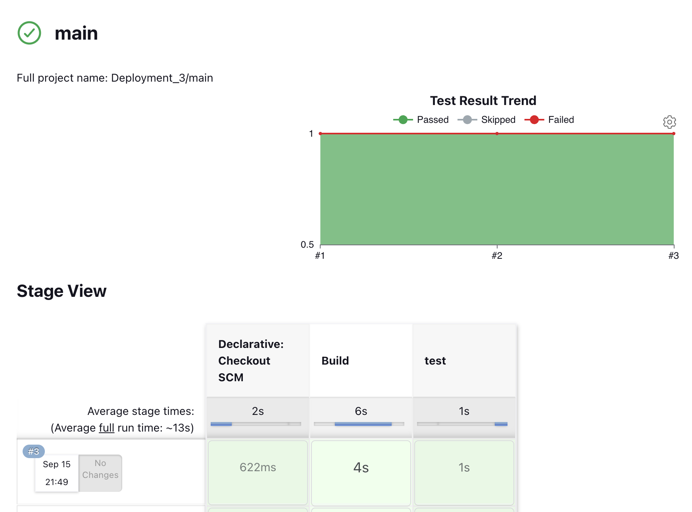
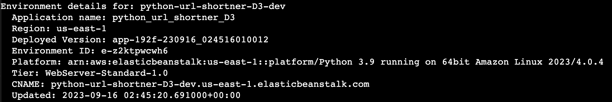

# Purpose:

To build on the progress of deployment 2 outlining the implementation of a fully automated CI/CD pipeline and related tasks.

This deployment uses Jenkins to fully automate the build, test, and deployment process of a python URL shortening application. The process uses the awsebcli utility to deploy a successful build to AWS Elastic Beanstalk.

## Deployment Files:

The following files are needed to run this deployment:

- `application.py` The main python application file
- `test_app.py` Tests used to test application functionality; used in Jenkins Test phase
- `requirements.txt` Required packages for python application
- `urls.json` Test URLS for application testing
- `Jenkinsfile` Configuration file used by Jenkins to run a pipeline
- `README.md` README documentation
- `Documentation.md` Documentation on how to run the deployment
- `static/` Folder housing CSS files
- `templates/` Folder housing HTML templates
- `images/` Folder housing deployment artifacts

# Steps:

1.  Launch an EC2 Instance and install Jenkins

    - Jenkins, an open-source software automation server, will be used to automate the process of pulling in the source code repository, building and running the application, and testing the application.
    - Install Jenkins Server using instructions at this [link](https://pkg.jenkins.io/debian/)
    - Install required version of python:
      - `sudo apt install python3.10-venv`
    - Browse to http://<instance public IP>:8080 to access the Jenkins server
      - Follow on-screen instructions to complete initial login

2.  Setup Multibranch Pipeline

    - From Dashboard, select a new item > Create Name > Mulitbranch Pipeline option
       
    - Under Configuration > General, set branch source to ‘GitHub’ option
       
    - Set Branch sources:
      - Credentials: [How to setup Github Access Token](https://docs.github.com/en/enterprise-server@3.8/authentication/keeping-your-account-and-data-secure/managing-your-personal-access-tokens)
      - Repository HTTPS URL: `<Github Repo URL>`
         
    - Apply and Save

3.  Run Pipeline

    - Select Build Now
    - During the pipeline run we're lookng for a successful build and test.
       
       

4.  Setup AWS CLI

    - Create a [AWS access and secret access key](https://docs.aws.amazon.com/IAM/latest/UserGuide/id_credentials_access-keys.html#Using_CreateAccessKey) credentials.
    - Download and install the AWS CLI files.

      > `curl "https://awscli.amazonaws.com/awscli-exe-linux-x86_64.zip" -o awscliv2.zip'` `unzip awsliv2.zip`

      > `sudo ./aws/install`

      > `aws configure`

      - `Enter AWS Access Key ID: <aws access key>`
      - `Enter AWS Secret Access: <aws secret key>`
      - `Region Name: us-east-1`
      - `Output Format: json`

5.  Setup AWS Elastic Beanstalk CLI for Jenkins User

    - Create a password for the jenkins user
      > `sudo passwd jenkins`
    - Switch to the jenkins user account
      > `sudo su - jenkins -s /bin/bash`
    - Install the AWS ebcli
      > `pip install awsebcli --upgrade --user` > `export PATH=$PATH:$HOME/.local/bin`
    - Configure awsbscli utility
      > `aws configure`
      - `Enter AWS Access Key ID: <aws access key>`
      - `Enter AWS Secret Access: <aws secret key>`
      - `Region Name: us-east-1`
      - `Output Format: json`

6.  Deploy to AWS Elastic Beanstalk from Jenkins

    - Navigate to the Jenkins multibranch pipeline directory
      > `cd workspace/Deployment3_main/`
    - Initialize directory for awsebcli
      > `eb init`
      - `us-east-1`
      - `Press enter for default`
      - `Environment: Python version 3.9`
      - `Code Commit: select No`
      - `SSH: select No`
    - Create AWS Elastic Beanstalk:

      > `eb create`

      - `Press enter for default`
      - `Press enter for default`
      - `Press enter for default`
      - `Spot Fleet: select No`
      - `SSH: select No`

    - Verify deployment to Elastic Beanstalk
       
       
       
       

7.  Add Deployment Phase to Jenkins Pipeline

    - Update the jenkinsfile with a new stage to represent the deployment phase. The `eb deploy` will be run during this phase to upload the application files to Elastic Beanstalk.
       
    - Run Jenkins pipeline to test deployment phase.
       
       
       

8.  Setup Github Webhook

    - In Github, navigate to the application's repository. Then, go to settings > webhooks > add webhook.
    - Configure the webhook payload with the Jenkins server webhook address, then, add webhook
       
    - Chech recent deliveries tab for a response and HTTP 200 code.
       
    - Now, any updates to a branch configured in Jenkins will automatically trigger the pipeline to run.

9.  Test Webhook with Test Commit
    - A test update to the source code in should start a Jenkins pipeline run.
    - The templates > home.html file was updated. A change was made to the block title updating "URL Shortener" to "PyD3 URL Shortener". Jenkins received the repo update via the wekhook post request and ran the pipeline.
       
       
       

# System Diagram:

CI/CD Pipeline Architecture [Link](https://github.com/kaedmond24/python_url_shortener_app_deployment_3/blob/main/c4_deployment_3.png)

# Issues:

No Issues Found

# Optimization:

1. This deployment is an improvement over deployments 1 and 2. The addition of webhooks and the awseb cli has optimized the deployment process by adding full automation. However, further improvements can be implemented to further refine the process. I believe having a delivery phase where multiple versions of the application can be created and stored would be beneficial. In the case of any issue with a current version in production, a previous version of the application can be quickly redeployed.
